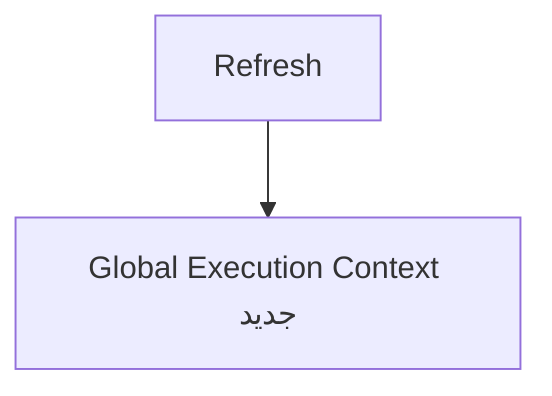

# 🧠 محیط اجرابرنامه و کدهای جاوااسکریپت

## محیطی که برای اجرای کدها ساخته میشه و دارای 3 مرحله هستن 
## 1.Global Execution Context
این مرحله اول و مرحله شروع اجرای کد هستش-هر JavaScript execution، قبل از اجرای کد، یک Global Execution Context ایجاد می‌کند.
> 💡 بار هر بار رفرش مجدد این محیط ساخته میشه

## 2.
