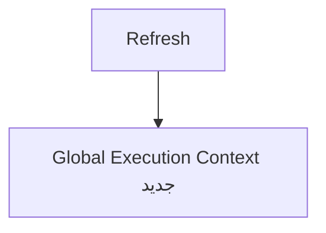

# 🧠 محیط اجرابرنامه و کدهای جاوااسکریپت

## محیطی که برای اجرای کدها ساخته میشه و دارای 3 مرحله هستن 
## 1.Global Execution Context
این مرحله اول و مرحله شروع اجرای کد هستش-هر JavaScript execution، قبل از اجرای کد، یک Global Execution Context ایجاد می‌کند.
> 💡 بار هر بار رفرش مجدد این محیط ساخته میشه


## 2.Function Execution Context

هربار که یه فانکشن فراخوانی بشه اجرا میشه

حتی اگر 10 بار یه فانکشن رو صدا بزنییم 10 بار ایجاد میشود

```mermaid
flowchart TD
    A[Global Execution Context] --> B[test() Context]
    B --> C[حذف]
    C --> D[test() Context]
    D --> E[حذف]
    E --> F[test() Context]
    F --> G[حذف]
    G --> H[بازگشت به Global]
```

## 3.Eval Execution Context
در جاوا اسکریپت جدید نیاز نیست
