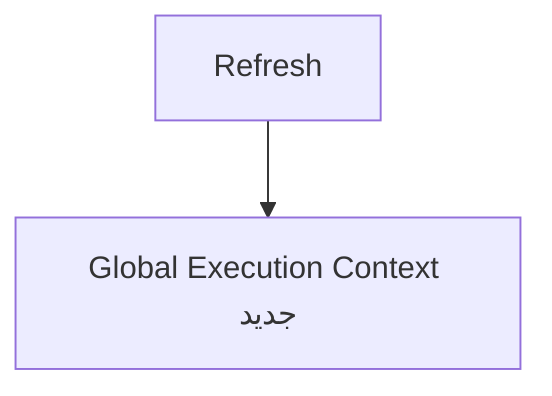
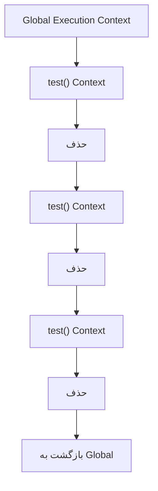
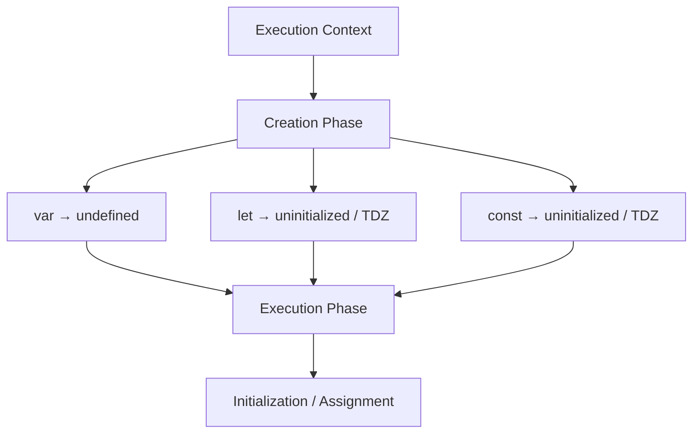

# 🧠 محیط اجرای برنامه و کدهای JavaScript

## Execution Context

محیطی است که JavaScript برای اجرای کد ایجاد می‌کند.

Execution Context انواع مختلفی دارد و هر Context به‌صورت ساده دو مرحله مهم را طی می‌کند:

1. **Creation Phase**
2. **Execution Phase**

---

## 1. Global Execution Context

این Context نقطه شروع اجرای یک JavaScript execution است.

> 💡 با هر بار Refresh صفحه، یک JavaScript execution جدید شروع می‌شود و در نتیجه یک Global Execution Context جدید ایجاد می‌شود.



---

## 2. Function Execution Context

هر بار که یک Function فراخوانی شود، یک **Function Execution Context جدید** ایجاد می‌شود.

حتی اگر یک Function را 10 بار فراخوانی کنیم، 10 Function Execution Context جداگانه ایجاد می‌شود.



---

## 3. Eval Execution Context

مربوط به اجرای کد با `eval()` است و در برنامه‌های مدرن JavaScript معمولاً با آن کاری نداریم.

---

# 🔄 مراحل ایجاد Execution Context

هر Execution Context به‌صورت ساده دو Phase مهم دارد:

## 1. Creation Phase

در این مرحله محیط اجرای Context آماده می‌شود.

به‌صورت ساده:

* Declarationها شناسایی و ثبت می‌شوند.
* محیط متغیرها آماده می‌شود.
* Scope و ارتباط‌های مربوط به Lexical Environment آماده می‌شوند.
* مقادیر اولیه لازم تعیین می‌شوند.
* رفتار مربوط به Hoisting از همین مرحله ناشی می‌شود.

### مثال

```js
console.log(hoistedVar); // undefined
console.log(hoistedFunction()); // "I'm hoisted!"

var hoistedVar = "Now I have a value";

function hoistedFunction() {
    return "I'm hoisted!";
}
```

در Creation Phase، JavaScript به‌صورت مفهومی چیزی شبیه این آماده می‌کند:

```text
hoistedVar → undefined

hoistedFunction → function
```

بنابراین وقتی Execution Phase شروع می‌شود، این کد:

```js
console.log(hoistedVar);
```

به `undefined` دسترسی پیدا می‌کند، نه اینکه متغیر اصلاً وجود نداشته باشد.

---

## 2. Execution Phase

در این مرحله JavaScript شروع به اجرای واقعی کد می‌کند.

در طول این مرحله:

* کد اجرا می‌شود.
* مقادیر به متغیرها Assignment می‌شوند.
* Functionها فراخوانی می‌شوند.
* دستورات و Expressions اجرا می‌شوند.
* در صورت فراخوانی Function، یک Function Execution Context جدید ایجاد می‌شود.

### مثال

```js
var name = "Kamyar";

function sayHello() {
    var message = "Hello";
    console.log(message);
}

sayHello();
```

در Creation Phase:

```text
name → undefined
sayHello → function
```

سپس در Execution Phase:

```text
name = "Kamyar"
        ↓
sayHello()
        ↓
Function Execution Context
        ↓
message = "Hello"
        ↓
console.log(message)
        ↓
"Hello"
```

---

# 🧩 var vs let vs const

رفتار `var`، `let` و `const` در Creation Phase یکسان نیست.

### `var`

```js
console.log(a);

var a = 10;
```

در Creation Phase به‌صورت مفهومی:

```text
a → undefined
```

پس در Execution Phase:

```js
console.log(a); // undefined
```

خطای `ReferenceError` نداریم.

---

### `let`

```js
console.log(b);

let b = 20;
```

در Creation Phase، `b` ثبت می‌شود اما هنوز Initialization نشده:

```text
b → uninitialized
```

از این قسمت تا رسیدن به `let b = 20`، متغیر در **TDZ (Temporal Dead Zone)** قرار دارد.

بنابراین:

```js
console.log(b);
```

باعث:

```text
ReferenceError
```

می‌شود.

---

### `const`

رفتار `const` از این نظر مانند `let` است:

```js
console.log(c);

const c = 30;
```

در Creation Phase:

```text
c → uninitialized
```

بنابراین `c` نیز قبل از Initialization در **TDZ** قرار دارد و دسترسی به آن باعث `ReferenceError` می‌شود.

---

### مقایسه

```text
Creation Phase

var a
  ↓
a → undefined
  ↓
قابل دسترسی است


let b
  ↓
b → uninitialized
  ↓
TDZ
  ↓
قابل دسترسی نیست


const c
  ↓
c → uninitialized
  ↓
TDZ
  ↓
قابل دسترسی نیست
```

بعد در Execution Phase:

```js
var a = 10;
let b = 20;
const c = 30;
```

مقادیر به متغیرها اختصاص داده می‌شوند.

> 🧠 **نکته:** هر سه `var`، `let` و `const` قبل از اجرای خط مربوط به Declaration، در فرآیند ایجاد Execution Context شناسایی می‌شوند؛ تفاوت اصلی در نحوه Initialization و امکان دسترسی به آن‌ها قبل از Initialization است.

### خلاصه نهایی



> 🧠 **نکته مهم:** Hoisting به معنی جابه‌جا شدن واقعی کد به بالای فایل نیست؛ بلکه نتیجه‌ی آماده‌سازی Declarationها در فرآیند ایجاد Execution Context است.
