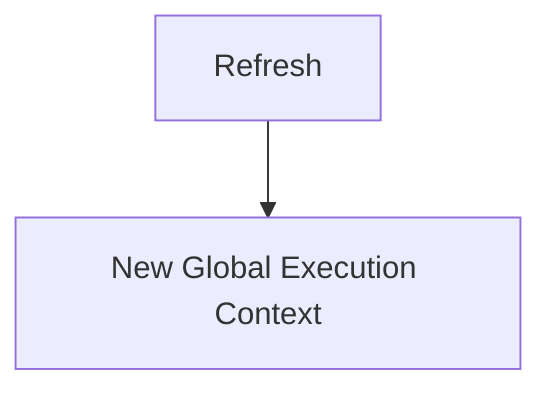
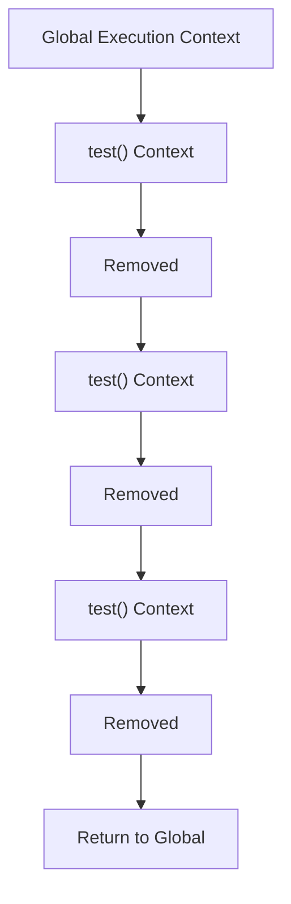
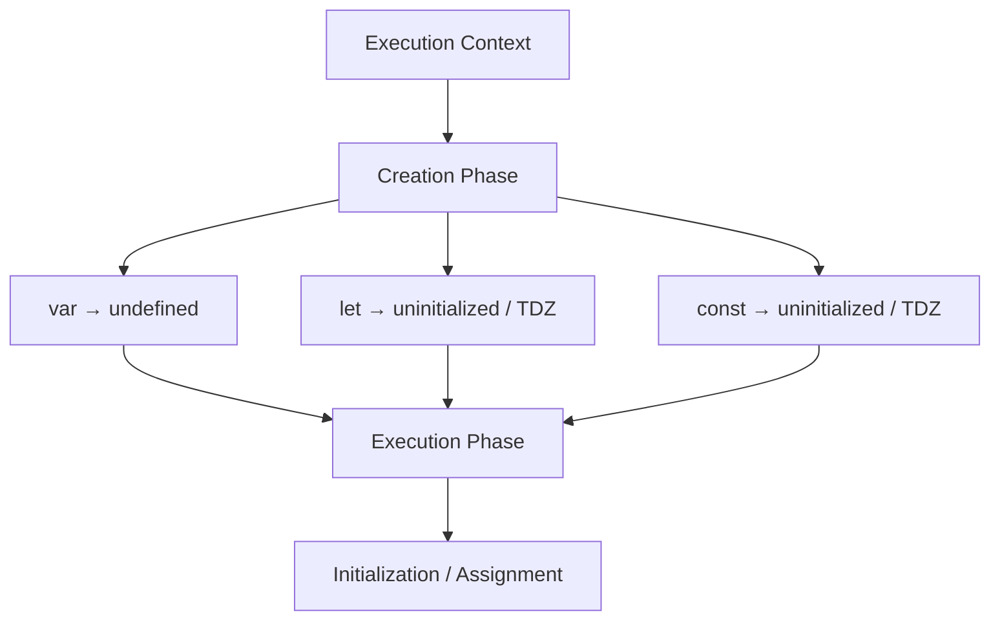

# 🧠 JavaScript Execution Environment and Code Execution

## Execution Context

An **Execution Context** is the environment that JavaScript creates to execute code.

There are different types of Execution Contexts, and each Context goes through two main phases:

1. **Creation Phase**
2. **Execution Phase**

---

## 1. Global Execution Context

This Context is the starting point of a JavaScript execution.

> 💡 Every time the page is refreshed, a new JavaScript execution starts, and as a result, a new Global Execution Context is created.



---

## 2. Function Execution Context

Every time a Function is called, a **new Function Execution Context** is created.

Even if we call the same Function 10 times, 10 separate Function Execution Contexts are created.



---

## 3. Eval Execution Context

This Context is related to code execution using `eval()` and is generally not something we need to deal with in modern JavaScript applications.

---

# 🔄 Execution Context Phases

Each Execution Context goes through two main phases:

## 1. Creation Phase

During this phase, the execution environment is prepared.

In simple terms:

* Declarations are identified and registered.
* The variable environment is prepared.
* Scope and the related Lexical Environment are prepared.
* Initial values are determined where necessary.
* Hoisting-related behavior originates from this phase.

### Example

```js
console.log(hoistedVar); // undefined
console.log(hoistedFunction()); // "I'm hoisted!"

var hoistedVar = "Now I have a value";

function hoistedFunction() {
    return "I'm hoisted!";
}
```

During the Creation Phase, JavaScript conceptually prepares something like this:

```text
hoistedVar → undefined

hoistedFunction → function
```

Therefore, when the Execution Phase starts, this code:

```js
console.log(hoistedVar);
```

can access `undefined` because the variable already exists in the execution environment.

---

## 2. Execution Phase

During this phase, JavaScript starts executing the actual code.

During this phase:

* Code is executed.
* Values are assigned to variables.
* Functions are called.
* Statements and Expressions are executed.
* When a Function is called, a new Function Execution Context is created.

### Example

```js
var name = "Kamyar";

function sayHello() {
    var message = "Hello";
    console.log(message);
}

sayHello();
```

During the Creation Phase:

```text
name → undefined
sayHello → function
```

Then, during the Execution Phase:

```text
name = "Kamyar"
        ↓
sayHello()
        ↓
Function Execution Context
        ↓
message = "Hello"
        ↓
console.log(message)
        ↓
"Hello"
```

---

# 🧩 var vs let vs const

The behavior of `var`, `let`, and `const` is not identical during the Creation Phase.

### `var`

```js
console.log(a);

var a = 10;
```

During the Creation Phase, JavaScript conceptually initializes `a` with:

```text
a → undefined
```

So during the Execution Phase:

```js
console.log(a); // undefined
```

No `ReferenceError` occurs.

---

### `let`

```js
console.log(b);

let b = 20;
```

During the Creation Phase, `b` is registered but has not yet been initialized:

```text
b → uninitialized
```

From this point until `let b = 20` is reached, the variable is in the **TDZ (Temporal Dead Zone)**.

Therefore:

```js
console.log(b);
```

causes:

```text
ReferenceError
```

---

### `const`

The behavior of `const` in this regard is similar to `let`:

```js
console.log(c);

const c = 30;
```

During the Creation Phase:

```text
c → uninitialized
```

Therefore, `c` is also in the **TDZ** before initialization, and accessing it causes a `ReferenceError`.

---

### Comparison

```text
Creation Phase

var a
  ↓
a → undefined
  ↓
Can be accessed


let b
  ↓
b → uninitialized
  ↓
TDZ
  ↓
Cannot be accessed


const c
  ↓
c → uninitialized
  ↓
TDZ
  ↓
Cannot be accessed
```

Then, during the Execution Phase:

```js
var a = 10;
let b = 20;
const c = 30;
```

The values are assigned to the variables.

> 🧠 **Note:** `var`, `let`, and `const` declarations are all processed during the creation of the Execution Context. The main difference is how they are initialized and whether they can be accessed before initialization.

### Final Summary



> 🧠 **Important:** Hoisting does not mean that JavaScript physically moves code to the top of the file. It refers to the behavior that results from processing declarations during the creation of an Execution Context.
